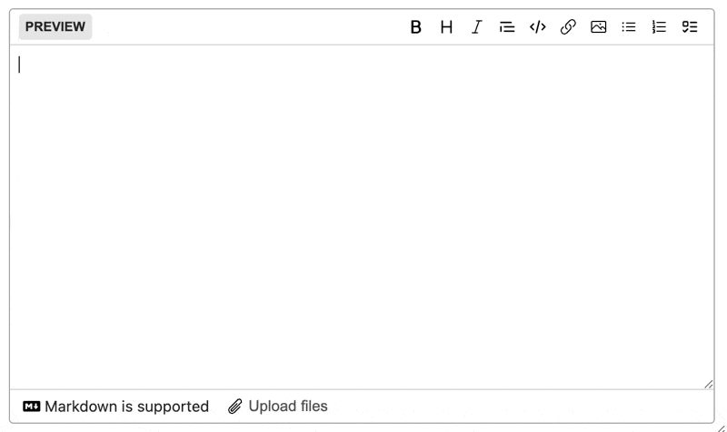

# Marksmith

[](https://github.com/avo-hq/marksmith/actions/workflows/ci.yml)

Marksmith is a GitHub-style markdown editor for Rails apps.

It supports Active Storage attachments and comes with a built-in markdown preview renderer.




> [!WARNING]
> Marksmith is at the initial stage of development. It's nearing a beta release, but the API might change and bugs are expected. Please continue to use the library and report any issues in the GitHub repo.

Temporary live demo here, under the description field: [https://main.avodemo.com/avo/resources/projects/new](https://main.avodemo.com/avo/resources/projects/new)

## Usage

```erb
<%= marksmith_tag :body %>
```

## Installation

#### 1. Add `marksmith` to your `Gemfile`

Have Bundler add it by running this command:

```bash
bundle add marksmith commonmarker
```

Or manually install it.

Add this line to your application's Gemfile:

```ruby
# Gemfile
gem "marksmith"
# Add a markdown parser
gem "commonmarker"
```

#### 2. Install the NPM package to import the StimulusJS controller.

Install the package from npmjs.org.

```bash
$ yarn add @avo-hq/marksmith
```

Or pin it using importmap.

```bash
bin/importmap pin @avo-hq/marksmith
```

Import and register the controllers in your application. The `ListContinuationController` is optional and only needed if you want to have continued lists in your markdown.

```js
import { MarksmithController, ListContinuationController } from '@avo-hq/marksmith'

application.register('marksmith', MarksmithController)
application.register('list-continuation', ListContinuationController)
```

> [!NOTE]
> Marksmith comes bundled with a few dependencies by default.
> If you want to manually import those dependencies and import only the controller from the package use the `/controller` path.

```js
// Manually import Marksmith's dependencies
import '@github/markdown-toolbar-element'
import { DirectUpload } from '@rails/activestorage'
import { post } from '@rails/request.js'
import { subscribe } from '@github/paste-markdown'

// Import just the controller
import { MarksmithController } from '@avo-hq/marksmith/core'

application.register('marksmith', MarksmithController)
```

#### 3. Add the style tag to your `application.html` layout

```erb
<%= stylesheet_link_tag "marksmith" %>
```

#### 4. Use it

Use a form helper tag or attach it to your form builder.

```erb
<%= marksmith_tag :body, value: "### This is important" %>
or
<%= form.marksmith :body %>
```

## Configuration

Marksmith accepts a few configuration options.

### Field options

The field supports a few of the regular options like `disabled`, `placeholder`, `autofocus`, `style`, `class`, `data`, and `value`, but also a custom one.

`extra_preview_params` - Sends extra params to the preview renderer.

`enable_file_uploads` - Whether to enable file uploads.

`upload_url` - The URL to use for file uploads. If not provided, the editor will use the `rails_direct_uploads_url` helper.

```erb
<%= marksmith_tag :body,
  disabled: true,
  placeholder: "Write your best markdown here.",
  extra_preview_params: { foo: "bar" },
  enable_file_uploads: true,
  upload_url: nil
  %>
```

### Eject configuration file

Marksmith comes with a default configuration file that you can eject to your app.

```bash
bin/rails generate marksmith:install
```

This will create a `config/initializers/marksmith.rb` file in your app.

### Mount path

The engine is mounted by default at `/marksmith`. You can change it by setting `Marksmith.configuration.mount_path` to a different path.

```ruby
# config/initializers/marksmith.rb
Marksmith.configure do |config|
  config.mount_path = "/markdown"
end
```

### Mounting the engine

The engine is mounted by default, but you can disable it by setting `Marksmith.configuration.automatically_mount_engine` to `false` and then manually mount the engine in your `routes.rb` file.

```ruby
# config/routes.rb
Rails.application.routes.draw do
  mount Marksmith::Engine => Marksmith.configuration.mount_path
end
```

## Built-in preview renderer

The renderer is powered by [`Commonmarker`](https://github.com/gjtorikian/commonmarker) by default but it can be changed to [`Redcarpet`](https://github.com/vmg/redcarpet) or ['kramdown'](https://github.com/gettalong/kramdown) in the configuration or add your own logic by customizing the `Marksmith::Renderer` model.
It supports basic styles like headings, `strong`, `italic` and others.

In your `show.html.erb` view or the place where you want to render the compiled markup use the `marksmithed` helper and it will run the content through the renderer.

```erb
<%== marksmithed post.body %>
```

> [!WARNING]
> Using the `<%==` tag will output the raw HTML, so ensure you sanitize the content to avoid XSS attacks.
>
> See how we do it [here](https://github.com/avo-hq/avo/blob/main/app/views/marksmith/shared/_rendered_body.html.erb#L2).
> ```ruby
> # sample sanitization
> sanitize(body, tags: %w(table th tr td span) + ActionView::Helpers::SanitizeHelper.sanitizer_vendor.safe_list_sanitizer.allowed_tags.to_a)
> ```

## Customize the renderer

Marksmith comes with a default renderer that uses `commonmarker` by default but it can be changed to `redcarpet` or `kramdown` in the configuration.

```ruby
# config/initializers/marksmith.rb
Marksmith.configure do |config|
  config.parser = "redcarpet"
end
```

### Add your own renderer

You can completely customize the renderer by overriding the `Marksmith::Renderer` model.

```ruby
# app/models/marksmith/renderer.rb
module Marksmith
  class Renderer
    def initialize(body:)
      @body = body
    end

    def render
      # Your custom renderer logic here
    end
  end
end
```

## Active Storage

The editor supports [ActiveStorage](https://guides.rubyonrails.org/active_storage_overview.html) uploads using drag and drop and pasting files into the field.

Whe used in Avo it supports injecting assets using the [Media Library feature](http://docs.avohq.io/3.0/media-library.html).


## List Continuation

Marksmith has this great opt-in feature where you can have your lists continued.
We need to add the `ListContinuation` controller too.

```js
import { ListContinuationController, MarksmithController } from '@avo-hq/marksmith'
// or /core for the no-dependencies version
import { ListContinuationController, MarksmithController } from '@avo-hq/marksmith/core'

application.register('marksmith', MarksmithController)
application.register('list-continuation', ListContinuationController)
```

## Who uses Marksmith?

- [Avo](https://avohq.io) - Ruby on Rails Code-Based App Builder Framework

*Open a PR and add your project here*

## Contributing

Contribution directions go here.

## License

The gem is available as open source under the terms of the [MIT License](https://opensource.org/licenses/MIT).

## Usage in Avo

Marksmith work wonderfully in Avo throught the default [markdown field](https://docs.avohq.io/3.0/fields/markdown.html).

## Other Open-Source Work

- [`active_storage-blurhash`](https://github.com/avo-hq/active_storage-blurhash) - A plug-n-play [blurhash](https://blurha.sh/) integration for images stored in ActiveStorage
- [`avo`](https://github.com/avo-hq/avo) - Build Internal Tools with Ruby on Rails
- [`class_variants`](https://github.com/avo-hq/class_variants) - Easily configure styles and apply them as classes. Very useful when you're implementing Tailwind CSS components and call them with different states.
- [`prop_initializer`](https://github.com/avo-hq/prop_initializer) - A flexible tool for defining properties on Ruby classes.
- [`stimulus-confetti`](https://github.com/avo-hq/stimulus-confetti) - The easiest way to add confetti to your StimulusJS app

## Try Avo ⭐️

If you enjoyed this gem try out [Avo](https://github.com/avo-hq/avo). It doubles your engineering speed without hiring extra developers. Teams build Internal Tools, Admin Panels, Content Management Systems, CRMs, and other types of Business Apps 10x faster on top of Ruby on Rails using Avo.

## Troubleshooting

If you ever get a 431 error from Vite, clear your brower's cache for `localhost` (chrome://settings/content/all?searchSubpage=localhost).

## Releasing

Run `bin/release x.y.z`, use `--dry` to skip publishing. This is not idempotent. If releasing fails, take note of where the process left off and continue manually.

### Details

In development we use `vite-rails` to compile and reload JS & CSS changes.

When releasing we use `rollup` to compile the StimulusJS controller and `@tailwindcss/cli` to compile the CSS.

The JS code is pushed to npmjs.org on `@avo-hq/marksmith` and the CSS file is shipped in the gem.
